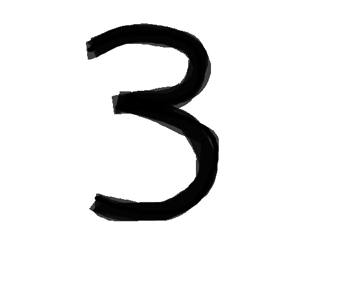

# Digital Recognizer

> python machine learning: digit-recognizer
> <br/>Deep leaning computer vision model built by 40000+ training and testing examples.</br>
> <br/>Recognize hand written digits or predict on big data sets </br>
> <br/>97% of accuracy over a 20,000 testing examples </br>


> picture example:
> <br/> </br>

> sample output:
> <br/>`My model predicted this images as:  [[3]] `</br>
> <br/>`This image is actually:  3` </br>

[](https://codecov.io/gh/py-ml/digit-recognizer)
[](https://travis-ci.org/py-ml/digit-recognizer)


<br/><a name="contents"></a>
## Contents

* [Design](dr/README.md)
* [Documentation](docs/README.md)
* [Prerequisites Checklist](#pre-req)
* [Dev Setup](#dev-setup)
* [Testing](#testing)


<br/><a name="pre-req"></a>
## Prerequisites

  * Python [3](https://www.python.org/downloads/)
  * Python 3 `pip` [version 19.0.1 and up](https://pip.pypa.io/en/stable/installing/)
  * Python 3 built-in virtual env [`venv`](https://docs.python.org/3/library/venv.html)
  * System tools: find, rm, tee, xargs, zip
  * Command line JSON processor: [jq](https://stedolan.github.io/jq/download/)
  * Docker ([optional](https://www.docker.com/))


<br/><a name="dev-setup"></a>
## Dev Setup

  Running a `dev-setup` script to install the project and libraries.

  ```
  make clean setup  # this will create a python virtualenv
  ```


<br/><a name="testing"></a>
## Testing

  After running `make dev-setup`, the project and libraries are installed (in python virtual environment). Now it is able to run tests.

  ```
  make test  # also available to run `make unittest` or `make nosetest`
  ```
  or to start a clean test (highly recommended before committing changes) -

  ```
  make clean test-all
  ```
  and open test coverage report

  ```
  make show  # must be on docker host
  ```


<p><br/></p>

[](https://codecov.io/gh/py-ml/digit-recognizer)
[](https://travis-ci.org/py-ml/digit-recognizer)
[](https://github.com/py-ml/digit-recognizer/graphs/contributors)
